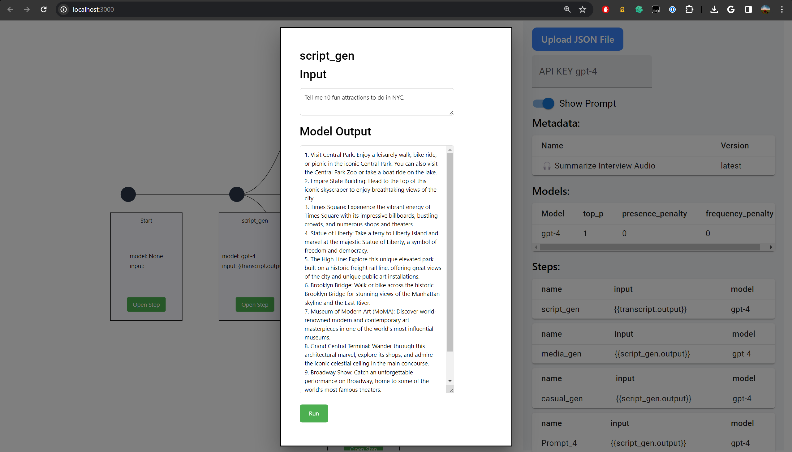
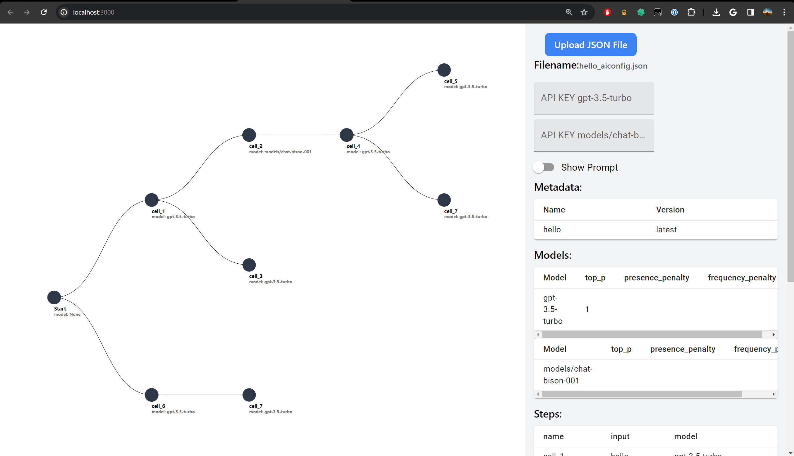

# LLaMahack NYC - Visualized aiconfig for developers - lastmile-ai

[](https://vercel.com/new/clone?repository-url=https://github.com/echo-cool/aiconfig-diagram-demo-app)


## Inspiration
The complexity of managing generative AI models and their parameters within application code has long been a hurdle for developers. The tight coupling of code with generative AI settings, including prompts and model-specific logic, not only adds unnecessary complexity but also hampers iteration and evaluation. Our inspiration arose from the desire to **unravel this complexity**, streamline the development process, and provide a **clearer visualization** of the **interconnected relationships** between different AI models.



## What it does
Our application leverages **Lastmile-ai's AIConfig** to parse aiconfig **JSON** files, presenting the details in a split-screen interface for enhanced readability. On one side, the content of the JSON file is displayed, and on the other, a visual diagram outlines the models identified within the file and their interconnections—showing which outputs are used as inputs for other models. It supports running the AIConfig file in its entirety or model by model, aiding developers in tweaking the entire pipeline or individual components with ease.



## How we built it
We built our application by integrating **Lastmile-ai's AIConfig SDK** into a user-friendly interface that automatically generates a visual flowchart from the JSON configuration files. This was accomplished by creating a parser that reads the JSON structure and dynamically creates nodes and edges to represent the flow of data between different AI models.

## Challenges we ran into
One of the main challenges was designing a parser that could accurately interpret the various configurations and nested structures within aiconfig files. Another challenge was creating a visual representation that was both informative and intuitive, allowing developers to quickly grasp the flow of information through their AI models.

## Accomplishments that we're proud of
We're particularly proud of our application's ability to simplify the complexity of AI model management. The visual flowchart not only aids in understanding but also in debugging and optimizing AI pipelines. We managed to create a tool that can potentially save developers hours of work by making the relationships between models clear and manageable.

## What we learned
Throughout this project, we deepened our understanding of how AI models can be efficiently managed and visualized. We also learned the importance of a well-designed **UI/UX** in the development of tools that handle complex information structures.

## What's next for Visualized aiconfig for developers - lastmile-ai
The next steps involve further refining the UI/UX, implementing features for more complex configurations, and adding support for additional models and parameters. We also plan to incorporate community feedback to ensure our tool remains aligned with the needs of developers working with AIConfig.


## Getting Started

First, run the development server:

```bash
npm run dev
# or
yarn dev
# or
pnpm dev
# or
bun dev
```

Open [http://localhost:3000](http://localhost:3000) with your browser to see the result.

You can start editing the page by modifying `app/page.tsx`. The page auto-updates as you edit the file.

This project uses [`next/font`](https://nextjs.org/docs/basic-features/font-optimization) to automatically optimize and load Inter, a custom Google Font.

## Learn More

To learn more about Next.js, take a look at the following resources:

- [Next.js Documentation](https://nextjs.org/docs) - learn about Next.js features and API.
- [Learn Next.js](https://nextjs.org/learn) - an interactive Next.js tutorial.

You can check out [the Next.js GitHub repository](https://github.com/vercel/next.js/) - your feedback and contributions are welcome!

## Deploy on Vercel

The easiest way to deploy your Next.js app is to use the [Vercel Platform](https://vercel.com/new?utm_medium=default-template&filter=next.js&utm_source=create-next-app&utm_campaign=create-next-app-readme) from the creators of Next.js.

Check out our [Next.js deployment documentation](https://nextjs.org/docs/deployment) for more details.

